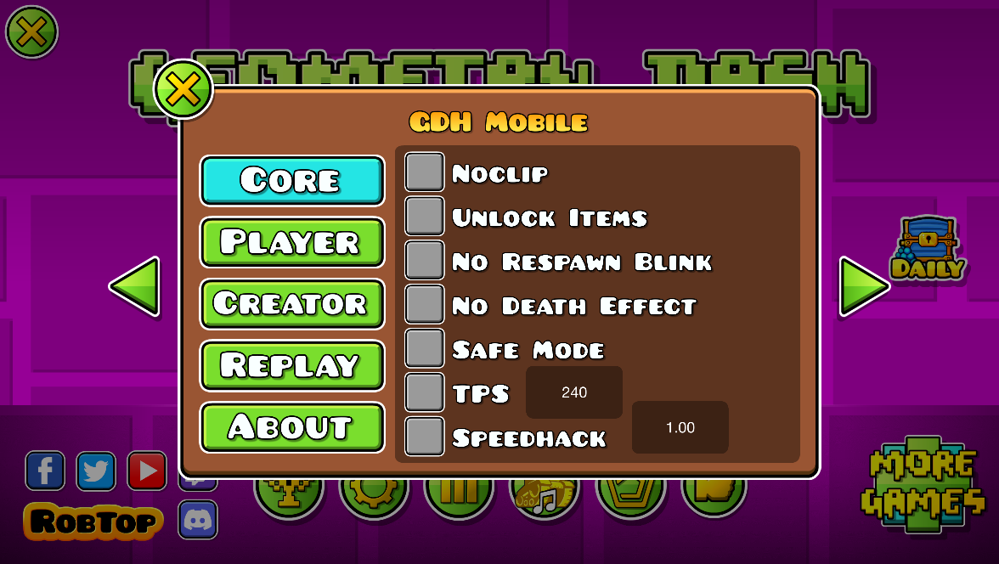

# GDH Mobile
Port of GDH to the Android version of Geometry Dash 

# Gallery

# Features
- Basic Hacks
- Bot called Replay Engine
- TPS Unlocker
- Speedhack
- Hitboxes
- And more!

# Install GDH Mobile directly through the mod catalogue in Geode itself
1. Make sure [Geode](https://geode-sdk.org/) is installed
2. In the mod install menu, under the Discover page, find GDH and install it
3. Restart the game
4. Press "Like" button to show the integrated menu